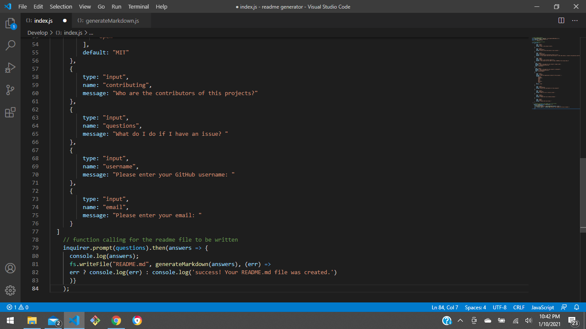
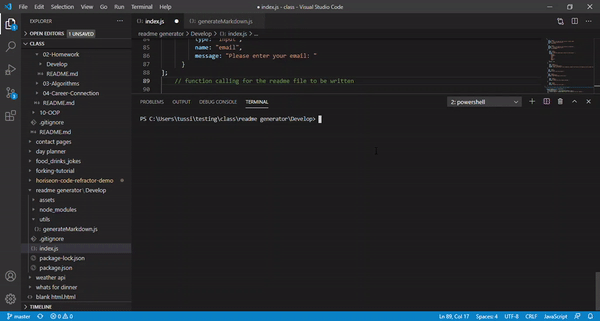

  
  # Readme-Generator
 
  ## Description
  This project focuses on the use of node.js to create command terminal prompts to collect information that will be used to create a high-quality readme file.
  
  ## Table of Contents
  - [Title](#Title)
  - [Description](#description)
  - [Table of Contents](#table-of-contents)
  - [Screenshots](#screenshots)
  - [Installation](#installation)
  - [Usage](#usage)
  - [License](#license)
  - [Contributing](#contributing)
  - [Questions and Feedback](#questions-and-feedback)

  ## Installation
   To use, simply clone the repo, run npm i -y, run node index.js, answer the questions and The README.md file will be created.

  ## Usage
  This project will be used to cread a README.md file using node.js.

  ## Technologies Used:
  Node.js and node modules: fs and inquirer.

  ## Code Sample
  In this sample code you can see how the prompts are orginized in arrays. With the use of the ('fs') module, the code adds the collected answers to a readme template and then creates a new readme file.
  

  ## Screenshots
  

  ## License
  MIT License - see the [LICENSE](https://github.com/tussingj89/Readme-Generator/blob/main/LICENSE) file for details.
  
  ## Testing 
  There is currently no testing available for this project.

  ## Contributing
  Before contributing to this repository, please discuss the change you wish to make via email or any other method with the owners of this repository.
  
  ## Questions and Feedback
  Please contact me using one of the following:
  - Github: [tussingj89](https://gist.github.com/tussingj89)
  - Email: tussing40@gmail.com
